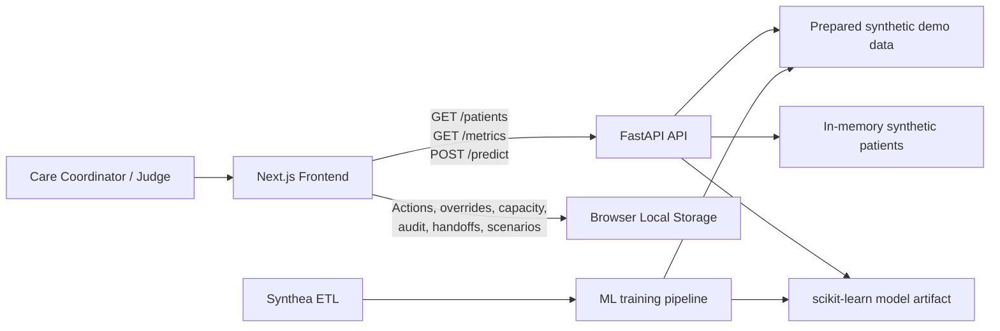

# ReadmitFlow Architecture

[](https://nextjs.org/)
[](https://www.typescriptlang.org/)
[](https://fastapi.tiangolo.com/)
[](https://www.python.org/)
[](https://scikit-learn.org/)
[](https://www.docker.com/)

## 1. System overview

ReadmitFlow is a hackathon-scale clinical decision-support prototype. It uses synthetic patient data to demonstrate an accountable workflow from risk review to a human-approved follow-up action, including shift handoff export and judge demo scenarios.



### Architectural principles

- **Human control first:** ReadmitFlow presents decision support, never autonomous clinical decisions.
- **Demo reliability:** workflow state lives in browser local storage, so no database, accounts, or network-dependent persistence is required.
- **Graceful fallback:** the frontend API client (`lib/api.ts`) includes rich mock patients and falls back to them transparently if the backend is unreachable — the demo always works.
- **Synthetic data only:** no real patient data or protected health information belongs in the repository.
- **Separation of concerns:** training code is isolated from the API; the API exposes prepared model outputs; the frontend owns presentation and demo workflow state.
- **Honest model boundary:** until organizers approve a valid readmission target, all risk scores must be visibly marked **Demo Only**.

## 2. Tech stack

| Layer | Technology | Purpose |
| --- | --- | --- |
| Web application | Next.js 14, React 18, TypeScript | Responsive UI and route-based pages |
| Styling | Tailwind CSS 3, shadcn/ui (Radix primitives) | Fast, consistent healthcare-style interface |
| PDF export | jsPDF | Client-side shift handoff PDF generation |
| Icons | Lucide React | Consistent icon system |
| API | FastAPI, Uvicorn, Pydantic v2 | Typed REST endpoints and input validation |
| ML and data | Python, pandas, scikit-learn, joblib, NumPy | Data preparation, baseline model, evaluation, model loading |
| Synthea ETL | Custom ETL pipeline (`ml/src/synthea_etl.py`) | Derive 30-day readmission labels from Synthea CSV exports |
| Workflow persistence | Browser Local Storage + Session Storage | Actions, overrides, capacity limits, audit events, and judge scenarios |
| Containerization | Docker, Docker Compose | Local multi-service orchestration |
| Frontend hosting | Vercel | Hosted Next.js application |
| API hosting | Render (Docker) | Hosted FastAPI service |
| Tests | pytest, FastAPI TestClient, Vitest / React Testing Library, Playwright | API, component, and end-to-end validation |
| Collaboration | GitHub | Source control, README, issues, submission evidence |

## 3. Repository layout

```text
readmit-flow/
├── README.md                         # Project overview, setup, safety boundary
├── ARCHITECTURE.md                   # This document
├── LICENSE                           # MIT license
├── .gitignore
├── .dockerignore
├── docker-compose.yml                # Local multi-container orchestration
├── render.yaml                       # Render blueprint deployment config
├── docs/
│   ├── demo-script.md                # Judge presentation flow
│   ├── api-contract.md               # Example API payloads
│   ├── data-dictionary.md            # Synthetic fields and meanings
│   ├── DEPLOYMENT.md                 # Step-by-step deployment guide
│   └── screenshots/                  # README/demo visuals
├── dataset/
│   ├── healthcare_dataset.csv        # Original organizer dataset (context only)
│   └── synthea/
│       ├── README.md                 # Synthea data source documentation
│       ├── encounter_features.csv    # Cached ETL output for training
│       ├── 10k_synthea_covid19_csv.zip
│       └── raw/                      # Extracted Synthea CSV files (git-ignored)
├── frontend/                         # Next.js application
├── backend/                          # FastAPI service and served demo data
├── ml/                               # Offline data and model pipeline
└── tests/                            # Cross-module automated tests (flat layout)
```

## 4. Frontend module

The frontend contains the product experience. It reads patient/model data from FastAPI (with transparent mock fallback) and stores only demo workflow state in the browser.

```text
frontend/
├── app/
│   ├── layout.tsx                    # Root layout, fonts, providers, global banner
│   ├── page.tsx                      # Command Center
│   ├── patients/
│   │   └── [id]/page.tsx             # Patient Review
│   ├── capacity/page.tsx             # Care Capacity Planner
│   ├── model-safety/page.tsx         # Metrics, assumptions, safety information
│   └── globals.css                   # Tailwind imports and shared styles
├── components/
│   ├── layout/
│   │   ├── app-shell.tsx             # Sidebar/header composition
│   │   ├── navigation.tsx            # Route navigation
│   │   ├── safety-banner.tsx         # Synthetic-data / non-diagnostic banner
│   │   └── scenario-coach.tsx        # Judge scenario step-by-step coach overlay
│   ├── command-center/
│   │   ├── risk-summary.tsx          # KPI cards and risk distribution
│   │   ├── patient-filters.tsx       # Search and tier filters
│   │   ├── patient-queue.tsx         # Sorted, clickable patient list
│   │   ├── add-patient-dialog.tsx    # Score a new synthetic patient via POST /predict
│   │   └── judge-scenarios.tsx       # Scenario picker for judge demo mode
│   ├── patient-review/
│   │   ├── patient-header.tsx        # Patient context and tier badge
│   │   ├── risk-drivers.tsx          # Plain-language contributing factors
│   │   ├── confidence-guard.tsx      # Data completeness and confidence flags
│   │   ├── action-form.tsx           # Follow-up action assignment
│   │   ├── override-dialog.tsx       # Human priority override with reason
│   │   ├── audit-timeline.tsx        # Workflow history
│   │   └── handoff-export.tsx        # Shift handoff export (TXT, CSV, PDF)
│   ├── capacity/
│   │   ├── capacity-settings.tsx     # Daily limit controls
│   │   └── allocation-board.tsx      # Slot allocation and remaining capacity
│   ├── model/
│   │   ├── metric-cards.tsx          # Precision, recall, F1, ROC-AUC
│   │   ├── confusion-matrix.tsx      # Metric visualization
│   │   └── limitation-card.tsx       # Safety and dataset limitations
│   └── ui/                           # shadcn/ui primitives (badge, button, card,
│                                     #   dialog, input, slider, table, tabs, tooltip)
├── lib/
│   ├── api.ts                        # Typed FastAPI client with mock fallback
│   ├── local-storage.ts              # Persistent demo workflow helpers
│   ├── handoff.ts                    # Shift handoff builders (text, CSV, HTML, PDF)
│   ├── scenarios.ts                  # Judge demo scenario definitions and state
│   ├── formatters.ts                 # Dates, percentages, risk labels, currency
│   ├── constants.ts                  # Action templates, tier colors, mock metrics
│   ├── types.ts                      # Shared frontend domain types
│   └── utils.ts                      # Utility helpers (cn)
├── hooks/
│   ├── use-patients.ts               # Patient/API data loading
│   ├── use-demo-workflow.ts          # Actions, overrides, audit, reset state
│   └── use-judge-scenario.ts         # Judge scenario session management
├── Dockerfile                        # Container build for production
├── vercel.json                       # Vercel deployment configuration
├── package.json
├── tailwind.config.ts
├── tsconfig.json
├── postcss.config.js
├── next.config.mjs
├── .env.example                      # NEXT_PUBLIC_API_URL
└── .env.production.example           # Production environment template
```

### Frontend responsibilities

- Render the Command Center, Patient Review, Capacity Planner, and Model/Safety pages.
- Display synthetic-data and decision-support warnings on every prediction surface.
- Fetch API data through `lib/api.ts` with transparent mock fallback when the backend is unreachable; do not embed API calls inside UI components.
- Persist assignments, overrides, capacity limits, and audit events using `lib/local-storage.ts`.
- Support shift handoff export (plaintext, CSV, HTML/print, PDF) via `lib/handoff.ts` and `handoff-export.tsx`.
- Provide a **Score patient** dialog that calls `POST /predict` and adds the scored synthetic patient to the local queue.
- Offer a **Reset Demo** control that returns browser workflow state to seeded defaults.
- Support guided **Judge Scenarios** for structured demo presentations via `lib/scenarios.ts` and the scenario coach overlay.

## 5. Backend module

The backend is deliberately small. It validates requests and returns prepared synthetic patient and model information. It does not persist care actions or integrate with clinical systems.

```text
backend/
├── app/
│   ├── __init__.py
│   ├── main.py                       # FastAPI app, router registration, CORS
│   ├── config.py                     # Environment settings and path configuration
│   ├── api/
│   │   ├── __init__.py
│   │   └── routes/
│   │       ├── __init__.py           # Versioned route aggregation
│   │       ├── health.py             # Health route delegate
│   │       ├── metrics.py            # Metrics route delegate
│   │       ├── patients.py           # Patients route delegate
│   │       └── prediction.py         # Prediction route delegate
│   ├── routers/
│   │   ├── __init__.py               # Router exports
│   │   ├── health.py                 # GET /health
│   │   ├── patients.py               # GET /patients and GET /patients/{id}
│   │   ├── predictions.py            # POST /predict
│   │   └── metrics.py                # GET /metrics
│   ├── schemas/
│   │   ├── __init__.py               # Schema re-exports
│   │   ├── common.py                 # Shared types (RiskDriver, ConfidenceInfo)
│   │   ├── patient.py                # Patient list/detail schemas
│   │   ├── prediction.py             # Prediction request/response schemas
│   │   └── metrics.py                # Metrics response schemas
│   ├── services/
│   │   ├── __init__.py
│   │   ├── patient_service.py        # Data filtering, search, and patient lookup
│   │   ├── prediction_service.py     # Prediction request delegation
│   │   ├── model_service.py          # Rule-based demo scoring and explainability
│   │   └── metrics_service.py        # Evaluation payload loading
│   ├── repositories/
│   │   └── demo_data_repository.py   # JSON file access layer
│   ├── data/
│   │   ├── __init__.py
│   │   └── synthetic_patients.py     # In-memory seed patients and default metrics
│   └── core/
│       ├── __init__.py
│       ├── errors.py                 # HTTP error helpers
│       └── safety.py                 # Demo-only response labels, tier thresholds
├── data/
│   ├── demo_patients.json            # Scored synthetic patient records (from ML pipeline)
│   └── metrics.json                  # Precomputed model metrics and notes
├── models/
│   └── readmission_model.joblib      # Trained model artifact
├── Dockerfile                        # Container build for Render/Docker
├── .dockerignore
└── requirements.txt                  # fastapi, uvicorn, pydantic, scikit-learn, pandas, etc.
```

### API contract

| Endpoint | Request | Response |
| --- | --- | --- |
| `GET /patients` | Optional `query`/`search`, `risk_tier`/`tier`, and `limit` query params | Prioritized synthetic patient list in `{ patients, total, demo_only }` envelope |
| `GET /patients/{id}` | Patient ID path parameter | Patient profile, score, drivers, confidence flags, templates in `{ patient, demo_only }` envelope |
| `POST /predict` | Validated manual patient-input payload (PredictionRequest) | Demo-only score, tier, drivers, confidence warnings |
| `GET /metrics` | None | Metrics, confusion-matrix values, preprocessing summary, limitations |
| `GET /health` | None | Service health and model/demo status |
| `GET /` | None | Service info, version, demo status, docs URL |

### Backend responsibilities

- Return safe, typed, synthetic data only.
- Return `404` for an unknown patient and `422` for invalid prediction input.
- Mark outputs as `demo_only: true` until organizers approve an appropriate readmission target and training approach.
- Keep model inference (rule-based scoring) in a service layer (`model_service.py`), not in route handlers.
- Provide both JSON-file-based patients (`demo_patients.json`) and in-memory seed patients (`synthetic_patients.py`) as data sources.
- Support Docker containerization with configurable `$PORT` binding for Render deployment.

## 6. ML module

The ML module runs offline. It prepares data, trains the baseline model, evaluates it, and exports artifacts consumed by the FastAPI API.

```text
ml/
├── notebooks/
│   └── exploration.ipynb             # Optional EDA; not production logic
├── src/
│   ├── __init__.py
│   ├── data_loading.py               # Source file loading and basic validation
│   ├── preprocessing.py              # Cleaning, encoding, feature preparation
│   ├── feature_engineering.py        # Transparent derived features
│   ├── training.py                   # Logistic regression and comparison model
│   ├── evaluation.py                 # ROC-AUC, precision, recall, F1, confusion matrix
│   ├── explainability.py             # Coefficient-based driver calculation
│   ├── export.py                     # joblib, patient JSON, metrics JSON exports
│   └── synthea_etl.py               # Synthea CSV → encounter feature table builder
├── train.py                          # Training pipeline entry point
├── prepare_demo_data.py              # Generate scored synthetic demo records
├── evaluate.py                       # Reproduce and export metrics
├── requirements.txt                  # pandas, scikit-learn, joblib, numpy
└── README.md                         # Dataset assumptions and model notes
```

### ML approach

1. **Synthea ETL**: Build encounter-level features from raw Synthea CSV exports. Derive a 30-day inpatient readmission label (next inpatient encounter within 30 days of discharge). Exclude deaths during index stays.
2. Validate the source and target label; stop training if no approved readmission target exists.
3. Split data into training and test sets before preprocessing to avoid leakage.
4. Use logistic regression as the primary explainable baseline.
5. Optionally compare a small tree-based model, but retain the simpler model if performance is comparable.
6. Export evaluation metrics, per-patient risk drivers, confidence/data-quality flags, and model metadata.
7. Never infer that a follow-up intervention will cause a risk score to change unless the model and data explicitly support that claim.

### Synthea ETL details

The `synthea_etl.py` module processes raw Synthea CSV files (`patients.csv`, `encounters.csv`, `conditions.csv`, `payers.csv`) into a flat encounter-level feature table with the following key fields:
- `age`, `gender`, `admission_count`, `days_since_last_admission`
- `primary_diagnosis` (mapped from free-text via rule-based categorization)
- `insurance`, `has_pcp`, `length_of_stay`, `admission_type`
- `readmitted_30d` (derived binary label)

## 7. Tests and documentation

Tests are organized in a flat layout within the `tests/` directory:

```text
tests/
├── README.md                         # Test documentation and run instructions
├── conftest.py                       # pytest fixtures and shared test config
├── setup.ts                          # Vitest/React Testing Library setup
├── vitest.config.ts                  # Vitest configuration
├── playwright.config.ts              # Playwright E2E configuration
│
│  # Backend tests (pytest)
├── test_health.py                    # API health response
├── test_patients.py                  # List, filter, detail, 404 behavior
├── test_predictions.py               # Valid and invalid manual inputs
├── test_metrics.py                   # Metrics payload completeness
│
│  # Frontend tests (Vitest / React Testing Library)
├── patient-queue.test.tsx            # Search, filtering, sorting
├── action-form.test.tsx              # Action validation and persistence
├── capacity.test.tsx                 # Capacity-limit enforcement
├── audit-timeline.test.tsx           # Override and audit rendering
│
│  # End-to-end (Playwright)
└── demo-flow.spec.ts                 # Queue -> review -> action -> capacity -> audit
```

| Test scenario | Expected behavior |
| --- | --- |
| Unknown patient ID | API returns `404`; UI shows a friendly recovery message. |
| Invalid manual prediction input | API returns `422`; UI highlights validation errors. |
| Missing patient fields | Confidence guard warns the reviewer before an action is assigned. |
| Capacity exhausted | UI prevents allocation beyond the configured daily limit. |
| Browser refresh | Actions, overrides, capacity limits, and audit history persist. |
| Reset Demo | Local workflow state returns to seeded demo values. |
| Safety boundary | Risk results and Model/Safety page state that the product is not diagnostic. |
| Handoff export | TXT/CSV/PDF downloads contain correct patient, risk, action, and audit data. |
| Judge scenarios | Scenario coach navigates steps correctly and resets demo state on start. |

## 8. Deployment and environment variables

### Docker Compose (local)

```bash
docker compose up --build
# Backend: http://localhost:8000
# Frontend: http://localhost:3000
```

### Cloud deployment

```text
Frontend (Vercel)
  NEXT_PUBLIC_API_URL=https://<render-service>.onrender.com

Backend (Render — Docker)
  ALLOWED_ORIGINS=https://<vercel-app>.vercel.app,http://localhost:3000
  DEMO_ONLY=true
  PORT=8000  (set automatically by Render)
```

- Deploy the frontend and backend independently, or use `docker-compose.yml` for local orchestration.
- The root `render.yaml` provides a Render Blueprint for one-click backend deployment.
- Each service has its own `Dockerfile` (`frontend/Dockerfile`, `backend/Dockerfile`).
- Configure CORS to permit only the Vercel deployment and local development origin.
- Keep a local backup running before the live hackathon demonstration.
- Do not commit `.env`, raw datasets, real API keys, or patient information.

## 9. Build order

1. Scaffold frontend and FastAPI service; seed synthetic demo records. ✅
2. Build Command Center and Patient Review before charts or visual polish. ✅
3. Add browser-local workflow state, action assignment, override reason, and audit trail. ✅
4. Add Capacity Planner and Model/Safety page. ✅
5. Connect ML export artifacts once a valid, organizer-approved label strategy exists. ✅
6. Add shift handoff export (TXT, CSV, PDF) for care coordinator transitions. ✅
7. Add judge demo scenarios with scenario coach overlay. ✅
8. Add Score Patient dialog for live synthetic case scoring. ✅
9. Add Docker/Docker Compose containerization and Render deployment config. ✅
10. Test the full demo flow, deploy to Vercel/Render, and verify the local fallback.
