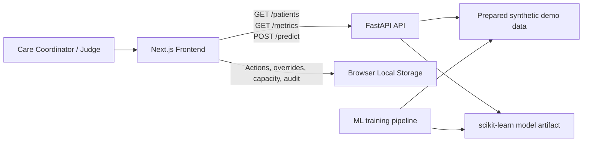

# ReadmitFlow Architecture

[](https://nextjs.org/)
[](https://www.typescriptlang.org/)
[](https://fastapi.tiangolo.com/)
[](https://www.python.org/)
[](https://scikit-learn.org/)

## 1. System overview

ReadmitFlow is a hackathon-scale clinical decision-support prototype. It uses synthetic patient data to demonstrate an accountable workflow from risk review to a human-approved follow-up action.



### Architectural principles

- **Human control first:** ReadmitFlow presents decision support, never autonomous clinical decisions.
- **Demo reliability:** workflow state lives in browser local storage, so no database, accounts, or network-dependent persistence is required.
- **Synthetic data only:** no real patient data or protected health information belongs in the repository.
- **Separation of concerns:** training code is isolated from the API; the API exposes prepared model outputs; the frontend owns presentation and demo workflow state.
- **Honest model boundary:** until organizers approve a valid readmission target, all risk scores must be visibly marked **Demo Only**.

## 2. Tech stack

| Layer | Technology | Purpose |
| --- | --- | --- |
| Web application | Next.js, React, TypeScript | Responsive UI and route-based pages |
| Styling | Tailwind CSS, shadcn/ui | Fast, consistent healthcare-style interface |
| Charts | Recharts | Risk distribution, metrics, and capacity visualizations |
| API | FastAPI, Uvicorn, Pydantic | Typed REST endpoints and input validation |
| ML and data | Python, pandas, scikit-learn, joblib | Data preparation, baseline model, evaluation, model loading |
| Workflow persistence | Browser Local Storage | Actions, overrides, capacity limits, and audit events |
| Frontend hosting | Vercel | Hosted Next.js application |
| API hosting | Render | Hosted FastAPI service |
| Tests | pytest, FastAPI TestClient, Vitest / React Testing Library | API and user-flow validation |
| Collaboration | GitHub | Source control, README, issues, submission evidence |

## 3. Repository layout

The tree below is the target implementation structure. Keep raw datasets out of Git and use only synthetic or approved de-identified data.

```text
readmit-flow/
├── README.md                         # Project overview, setup, safety boundary
├── ARCHITECTURE.md                   # This document
├── LICENSE                           # MIT license
├── .gitignore
├── docs/
│   ├── demo-script.md                # Judge presentation flow
│   ├── api-contract.md               # Example API payloads
│   ├── data-dictionary.md            # Synthetic fields and meanings
│   └── screenshots/                  # README/demo visuals
├── frontend/                         # Next.js application
├── backend/                          # FastAPI service and served demo data
├── ml/                               # Offline data and model pipeline
├── tests/                            # Cross-module automated tests
└── scripts/                          # Optional setup, seed, and verification scripts
```

## 4. Frontend module

The frontend contains the product experience. It reads patient/model data from FastAPI and stores only demo workflow state in the browser.

```text
frontend/
├── app/
│   ├── layout.tsx                    # Root layout, fonts, providers, global banner
│   ├── page.tsx                      # Command Center
│   ├── patients/
│   │   └── [id]/page.tsx             # Patient Review
│   ├── capacity/page.tsx             # Care Capacity Planner
│   ├── model-safety/page.tsx         # Metrics, assumptions, safety information
│   └── globals.css                   # Tailwind imports and shared styles
├── components/
│   ├── layout/
│   │   ├── app-shell.tsx             # Sidebar/header composition
│   │   ├── navigation.tsx            # Route navigation
│   │   └── safety-banner.tsx         # Synthetic-data / non-diagnostic banner
│   ├── command-center/
│   │   ├── risk-summary.tsx          # KPI cards and risk distribution
│   │   ├── patient-filters.tsx       # Search and tier filters
│   │   └── patient-queue.tsx         # Sorted, clickable patient list
│   ├── patient-review/
│   │   ├── patient-header.tsx        # Patient context and tier badge
│   │   ├── risk-drivers.tsx          # Plain-language contributing factors
│   │   ├── confidence-guard.tsx      # Data completeness and confidence flags
│   │   ├── action-form.tsx           # Follow-up action assignment
│   │   ├── override-dialog.tsx       # Human priority override with reason
│   │   └── audit-timeline.tsx        # Workflow history
│   ├── capacity/
│   │   ├── capacity-settings.tsx     # Daily limit controls
│   │   └── allocation-board.tsx      # Slot allocation and remaining capacity
│   ├── model/
│   │   ├── metric-cards.tsx          # Precision, recall, F1, ROC-AUC
│   │   ├── confusion-matrix.tsx      # Metric visualization
│   │   └── limitation-card.tsx       # Safety and dataset limitations
│   └── ui/                           # shadcn/ui primitives
├── lib/
│   ├── api.ts                        # Typed FastAPI client
│   ├── local-storage.ts              # Persistent demo workflow helpers
│   ├── formatters.ts                 # Dates, percentages, risk labels
│   ├── constants.ts                  # Action templates and tier colors
│   └── types.ts                      # Shared frontend domain types
├── hooks/
│   ├── use-patients.ts               # Patient/API data loading
│   └── use-demo-workflow.ts          # Actions, overrides, audit, reset state
├── public/
│   └── brand/                        # Logo and static demo assets
├── package.json
├── tailwind.config.ts
├── tsconfig.json
├── next.config.ts
└── .env.example                      # NEXT_PUBLIC_API_URL
```

### Frontend responsibilities

- Render the Command Center, Patient Review, Capacity Planner, and Model/Safety pages.
- Display synthetic-data and decision-support warnings on every prediction surface.
- Fetch API data through `lib/api.ts`; do not embed API calls inside UI components.
- Persist assignments, overrides, capacity limits, and audit events using `lib/local-storage.ts`.
- Offer a **Reset Demo** control that returns browser workflow state to seeded defaults.

## 5. Backend module

The backend is deliberately small. It validates requests and returns prepared synthetic patient and model information. It does not persist care actions or integrate with clinical systems.

```text
backend/
├── app/
│   ├── main.py                       # FastAPI app, router registration, CORS
│   ├── config.py                     # Environment settings and path configuration
│   ├── schemas.py                    # Pydantic request/response schemas
│   ├── routers/
│   │   ├── patients.py               # GET /patients and GET /patients/{id}
│   │   ├── predictions.py            # POST /predict
│   │   └── metrics.py                # GET /metrics
│   ├── services/
│   │   ├── patient_service.py        # Data filtering and patient lookup
│   │   ├── prediction_service.py     # Model loading and demo-only prediction
│   │   └── metrics_service.py        # Evaluation payload loading
│   ├── repositories/
│   │   └── demo_data_repository.py   # JSON/CSV file access layer
│   └── core/
│       ├── errors.py                 # HTTP error helpers
│       └── safety.py                 # Demo-only response labels and limits
├── data/
│   ├── demo_patients.json            # Scored synthetic patient records
│   └── metrics.json                  # Precomputed model metrics and notes
├── models/
│   └── readmission_model.joblib      # Approved model artifact only
├── requirements.txt
├── render.yaml                       # Render deployment configuration
└── .env.example
```

### API contract

| Endpoint | Request | Response |
| --- | --- | --- |
| `GET /patients` | Optional search, tier, and limit query parameters | Prioritized synthetic patient list |
| `GET /patients/{id}` | Patient ID path parameter | Patient profile, score, drivers, confidence flags, templates |
| `POST /predict` | Validated manual patient-input payload | Demo-only score, tier, drivers, confidence warnings |
| `GET /metrics` | None | Metrics, confusion-matrix values, preprocessing summary, limitations |
| `GET /health` | None | Service health and model/demo status |

### Backend responsibilities

- Return safe, typed, synthetic data only.
- Return `404` for an unknown patient and `422` for invalid prediction input.
- Mark outputs as `demo_only: true` until organizers approve an appropriate readmission target and training approach.
- Keep model loading in a service layer, not in route handlers.

## 6. ML module

The ML module runs offline. It prepares data, trains the baseline model, evaluates it, and exports artifacts consumed by the FastAPI API.

```text
ml/
├── data/
│   ├── raw/                          # Ignored by Git; source synthetic CSV only
│   └── processed/                    # Prepared train/test and demo exports
├── notebooks/
│   └── exploration.ipynb             # Optional EDA; not production logic
├── src/
│   ├── data_loading.py               # Source file loading and basic validation
│   ├── preprocessing.py              # Cleaning, encoding, feature preparation
│   ├── feature_engineering.py        # Transparent derived features
│   ├── training.py                   # Logistic regression and comparison model
│   ├── evaluation.py                 # ROC-AUC, precision, recall, F1, confusion matrix
│   ├── explainability.py             # Coefficient-based driver calculation
│   └── export.py                     # joblib, patient JSON, metrics JSON exports
├── train.py                          # Training pipeline entry point
├── prepare_demo_data.py              # Generate scored synthetic demo records
├── evaluate.py                       # Reproduce and export metrics
├── requirements.txt
└── README.md                         # Dataset assumptions and model notes
```

### ML approach

1. Validate the source and target label; stop training if no approved readmission target exists.
2. Split data into training and test sets before preprocessing to avoid leakage.
3. Use logistic regression as the primary explainable baseline.
4. Optionally compare a small tree-based model, but retain the simpler model if performance is comparable.
5. Export evaluation metrics, per-patient risk drivers, confidence/data-quality flags, and model metadata.
6. Never infer that a follow-up intervention will cause a risk score to change unless the model and data explicitly support that claim.

## 7. Tests and documentation

```text
tests/
├── backend/
│   ├── test_health.py                # API health response
│   ├── test_patients.py              # List, filter, detail, 404 behavior
│   ├── test_predictions.py           # Valid and invalid manual inputs
│   └── test_metrics.py               # Metrics payload completeness
├── frontend/
│   ├── patient-queue.test.tsx        # Search, filtering, sorting
│   ├── action-form.test.tsx          # Action validation and persistence
│   ├── capacity.test.tsx             # Capacity-limit enforcement
│   └── audit-timeline.test.tsx       # Override and audit rendering
└── e2e/
    └── demo-flow.spec.ts             # Queue -> review -> action -> capacity -> audit
```

| Test scenario | Expected behavior |
| --- | --- |
| Unknown patient ID | API returns `404`; UI shows a friendly recovery message. |
| Invalid manual prediction input | API returns `422`; UI highlights validation errors. |
| Missing patient fields | Confidence guard warns the reviewer before an action is assigned. |
| Capacity exhausted | UI prevents allocation beyond the configured daily limit. |
| Browser refresh | Actions, overrides, capacity limits, and audit history persist. |
| Reset Demo | Local workflow state returns to seeded demo values. |
| Safety boundary | Risk results and Model/Safety page state that the product is not diagnostic. |

## 8. Deployment and environment variables

```text
Frontend (Vercel)
  NEXT_PUBLIC_API_URL=https://<render-service>.onrender.com

Backend (Render)
  ALLOWED_ORIGINS=https://<vercel-app>.vercel.app,http://localhost:3000
  DEMO_ONLY=true
  MODEL_PATH=models/readmission_model.joblib
```

- Deploy the frontend and backend independently.
- Configure CORS to permit only the Vercel deployment and local development origin.
- Keep a local backup running before the live hackathon demonstration.
- Do not commit `.env`, raw datasets, real API keys, or patient information.

## 9. Build order

1. Scaffold frontend and FastAPI service; seed synthetic demo records.
2. Build Command Center and Patient Review before charts or visual polish.
3. Add browser-local workflow state, action assignment, override reason, and audit trail.
4. Add Capacity Planner and Model/Safety page.
5. Connect ML export artifacts once a valid, organizer-approved label strategy exists.
6. Test the full demo flow, deploy to Vercel/Render, and verify the local fallback.
