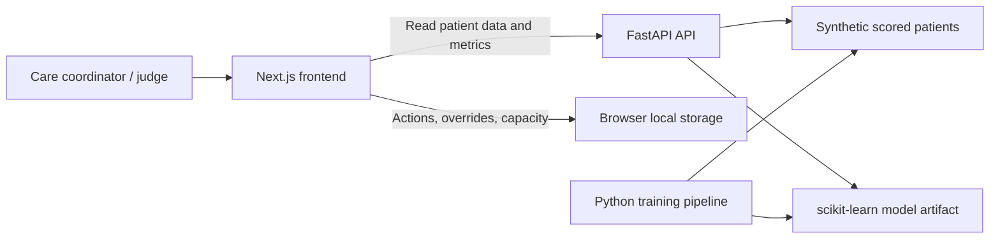

# ReadmitFlow

[](https://nextjs.org/)
[](https://react.dev/)
[](https://www.typescriptlang.org/)
[](https://tailwindcss.com/)
[](https://fastapi.tiangolo.com/)
[](https://www.python.org/)
[](https://scikit-learn.org/)
[](./LICENSE)

**ReadmitFlow** is an explainable discharge decision-support prototype. It helps care teams identify patients at potential readmission risk, understand the reasons behind a score, and assign human-approved follow-up actions.

> Built with synthetic data for a hackathon prototype. ReadmitFlow is not a diagnostic tool and must not be used to make autonomous clinical decisions.

## Why ReadmitFlow

A prediction score alone does not improve follow-up care. ReadmitFlow closes the workflow loop:

```text
Prioritize high-risk patients -> understand risk drivers -> approve a follow-up action
-> assign limited care capacity -> retain an auditable action record
```

## Key features

- **Command Center** - searchable, prioritized patient queue with risk tiers and capacity summary.
- **Patient Review** - patient-level score, plain-language risk drivers, confidence, and data-quality flags.
- **Human-approved actions** - assign a follow-up action, owner, due date, and status.
- **Override and audit trail** - staff can adjust a recommendation with a recorded reason.
- **Care Capacity Planner** - allocate limited follow-up calls or specialist-review slots responsibly.
- **Model and Safety page** - show evaluation metrics, assumptions, limitations, and decision-support boundaries.
- **Demo-mode persistence** - actions, overrides, capacity settings, and audit events survive refresh in browser local storage.

## Architecture



| Layer | Technology | Responsibility |
| --- | --- | --- |
| Frontend | Next.js, TypeScript, Tailwind CSS, shadcn/ui, Recharts | Product experience and local workflow state |
| API | FastAPI, Pydantic | Patient, metric, and manual-prediction endpoints |
| ML | pandas, scikit-learn, joblib | Data preparation, baseline model, evaluation, explanations |
| Deployment | Vercel + Render | Hosted frontend and API; local fallback retained for demos |

## Product flow

1. Open the **Command Center** and find high-priority patients.
2. Review a patient score, its risk drivers, and input-data confidence.
3. Select or adjust a follow-up template; a staff member retains final authority.
4. Assign an owner, due date, and available capacity slot.
5. Review the recorded action and override history.

## Planned routes

| Route | Purpose |
| --- | --- |
| `/` | Command Center |
| `/patients/[id]` | Patient Review |
| `/capacity` | Care Capacity Planner |
| `/model-safety` | Model metrics, limitations, and safety information |

## Planned API

| Endpoint | Purpose |
| --- | --- |
| `GET /patients` | Return scored, preprocessed demo patients. |
| `GET /patients/{id}` | Return one patient, drivers, flags, and recommendation templates. |
| `POST /predict` | Validate manual inputs and return a demo-only result until a model is approved. |
| `GET /metrics` | Return validation metrics, preprocessing notes, and limitations. |

## Local development

### Prerequisites

- Node.js 20+
- Python 3.11+

### Frontend

```bash
cd frontend
npm install
npm run dev
```

### Backend

```bash
cd backend
python -m venv .venv
.venv\Scripts\activate
pip install -r requirements.txt
uvicorn app.main:app --reload
```

The frontend reads the API URL from `NEXT_PUBLIC_API_URL`. Copy `.env.example` to `.env.local` and point it at the local FastAPI server.

## Data and responsible use

- Use only synthetic or de-identified data in this prototype.
- The organizer-specified healthcare dataset may not contain a valid readmission target. Until an approved target strategy exists, any displayed risk result must be marked **Demo Only**.
- Recommendations are review templates, not medication, treatment, or diagnostic advice.
- Staff can override any recommendation, and the reason is retained in the audit history.
- The prototype has no authentication, EHR integration, real messaging, or production-grade security.

## Demo checklist

- [ ] Patient queue loads with low-, medium-, and high-risk examples.
- [ ] Patient review shows drivers and confidence/data-quality flags.
- [ ] Action assignment, override, and audit history persist after refresh.
- [ ] Capacity assignment cannot exceed configured limits.
- [ ] Model/Safety page shows validation metrics and limitations.
- [ ] Hosted deployment and local fallback are tested before presentation.

## License

This project is intended for educational and hackathon use. Add an MIT `LICENSE` file before publishing the repository.
