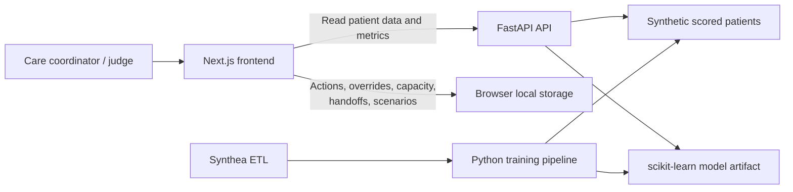

# ReadmitFlow

[](https://nextjs.org/)
[](https://react.dev/)
[](https://www.typescriptlang.org/)
[](https://tailwindcss.com/)
[](https://fastapi.tiangolo.com/)
[](https://www.python.org/)
[](https://scikit-learn.org/)
[](https://www.docker.com/)
[](https://readmitflow.vercel.app/)
[](https://readmitflow-backend.onrender.com/docs)
[](./LICENSE)

**ReadmitFlow** is an explainable clinical discharge decision-support prototype. It helps care teams identify patients at potential readmission risk, understand the reasons behind a score, and assign human-approved follow-up actions — with shift handoff export and guided judge demo scenarios.

- **Live Web Application:** [https://readmitflow.vercel.app/](https://readmitflow.vercel.app/)
- **Backend API & Swagger Docs:** [https://readmitflow-backend.onrender.com/docs](https://readmitflow-backend.onrender.com/docs)
- **GitHub Repository:** [https://github.com/Omega-127/ReadmitFlow](https://github.com/Omega-127/ReadmitFlow)

> Built with synthetic data for a hackathon prototype. ReadmitFlow is not a diagnostic tool and must not be used to make autonomous clinical decisions.

## Why ReadmitFlow

A prediction score alone does not improve follow-up care. ReadmitFlow closes the workflow loop:

```text
Prioritize high-risk patients -> understand risk drivers -> approve a follow-up action
-> assign limited care capacity -> export shift handoff -> retain an auditable action record
```

## Key features

- **Command Center** — searchable, prioritized patient queue with risk tiers and capacity summary.
- **Patient Review** — patient-level score, plain-language risk drivers, confidence, and data-quality flags.
- **Human-approved actions** — assign a follow-up action, owner, due date, and status.
- **Override and audit trail** — staff can adjust a recommendation with a recorded reason.
- **Care Capacity Planner** — allocate limited follow-up calls or specialist-review slots responsibly.
- **Shift Handoff Export** — generate and download a shift handoff summary as TXT, CSV, or PDF for care coordinator transitions.
- **Score Patient** — enter synthetic patient characteristics and score them live via `POST /predict`; new patients are added to the local queue.
- **Judge Demo Scenarios** — five pre-built guided scenarios (high-risk triage, override & audit, capacity crunch, live scoring, model honesty) with a step-by-step scenario coach overlay.
- **Model and Safety page** — show evaluation metrics, confusion matrix, assumptions, limitations, and decision-support boundaries.
- **Demo-mode persistence** — actions, overrides, capacity settings, and audit events survive refresh in browser local storage.
- **Graceful fallback** — the frontend includes rich mock patients and works fully offline if the backend is unreachable.

## Architecture



| Layer | Technology | Responsibility |
| --- | --- | --- |
| Frontend | Next.js 14, TypeScript, Tailwind CSS, shadcn/ui, jsPDF, Lucide | Product experience, local workflow state, shift handoff export |
| API | FastAPI, Pydantic v2, Uvicorn | Patient, metric, and manual-prediction endpoints |
| ML | pandas, scikit-learn, joblib, NumPy | Data preparation, Synthea ETL, baseline model, evaluation, explanations |
| Containerization | Docker, Docker Compose | Local multi-service orchestration |
| Deployment | Vercel + Render | Hosted frontend and API; local fallback retained for demos |

## Product flow

1. Open the **Command Center** and find high-priority patients.
2. Review a patient score, its risk drivers, and input-data confidence.
3. Select or adjust a follow-up template; a staff member retains final authority.
4. Assign an owner, due date, and available capacity slot.
5. Export a **shift handoff** (TXT, CSV, or PDF) for the next care coordinator.
6. Review the recorded action and override history.

## Routes

| Route | Purpose |
| --- | --- |
| `/` | Command Center |
| `/patients/[id]` | Patient Review |
| `/capacity` | Care Capacity Planner |
| `/model-safety` | Model metrics, limitations, and safety information |

## API

| Endpoint | Purpose |
| --- | --- |
| `GET /patients` | Return scored, preprocessed demo patients. Supports `query`/`search`, `risk_tier`/`tier`, and `limit` params. |
| `GET /patients/{id}` | Return one patient, drivers, flags, and recommendation templates. |
| `POST /predict` | Validate manual inputs and return a demo-only risk result. |
| `GET /metrics` | Return validation metrics, preprocessing notes, and limitations. |
| `GET /health` | Service health check. |

## Local development

### Prerequisites

- Node.js 20+
- Python 3.11+

### Frontend

```bash
cd frontend
npm install
npm run dev
```

### Backend

```bash
cd backend
python -m venv .venv
.venv\Scripts\activate
pip install -r requirements.txt
uvicorn app.main:app --reload
```

The frontend reads the API URL from `NEXT_PUBLIC_API_URL`. Copy `.env.example` to `.env.local` and point it at the local FastAPI server. If the backend is unreachable, the frontend automatically falls back to built-in mock data.

### Docker Compose

```bash
docker compose up --build
# Backend: http://localhost:8000
# Frontend: http://localhost:3000
```

## Deployment
 
- **Frontend** → [https://readmitflow.vercel.app/](https://readmitflow.vercel.app/) (Vercel)
- **Backend** → [https://readmitflow-backend.onrender.com](https://readmitflow-backend.onrender.com) (Render Docker Web Service)
- **API Docs (Swagger)** → [https://readmitflow-backend.onrender.com/docs](https://readmitflow-backend.onrender.com/docs)
- Use the root `render.yaml` for blueprint deployment, or deploy manually. See `docs/DEPLOYMENT.md` for detailed instructions.
- Each service has its own `Dockerfile`.

## Data and responsible use

- Use only synthetic or de-identified data in this prototype.
- Default training data is **Synthea** (COVID-19 10K CSV) with a derived 30-day inpatient readmission label. See `dataset/synthea/README.md`.
- The Synthea ETL (`ml/src/synthea_etl.py`) extracts encounter-level features and a binary readmission target from raw CSV exports.
- Recommendations are review templates, not medication, treatment, or diagnostic advice.
- Staff can override any recommendation, and the reason is retained in the audit history.
- The prototype has no authentication, EHR integration, real messaging, or production-grade security.

## Demo checklist

- [x] Patient queue loads with low-, medium-, and high-risk examples.
- [x] Patient review shows drivers and confidence/data-quality flags.
- [x] Action assignment, override, and audit history persist after refresh.
- [x] Capacity assignment cannot exceed configured limits.
- [x] Model/Safety page shows validation metrics and limitations.
- [x] Shift handoff export (TXT, CSV, PDF) available from Patient Review.
- [x] Score Patient dialog scores new synthetic cases via POST /predict.
- [x] Judge demo scenarios guide structured presentations.
- [x] Docker Compose orchestration works locally.
- [x] Hosted deployment and local fallback are tested before presentation.

## License

This project is intended for educational and hackathon use. See the [LICENSE](./LICENSE) file.

---

*Signed off by Team Runtime Rebels*
